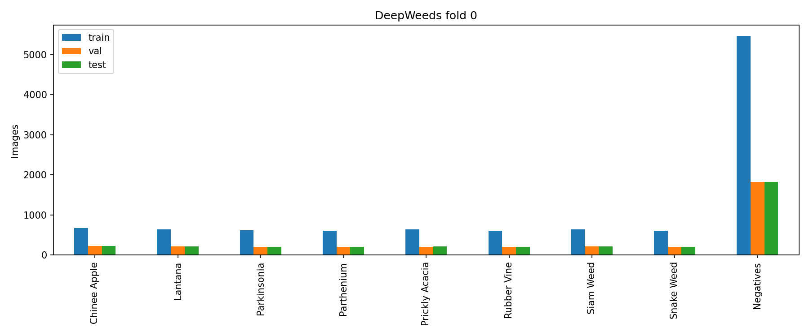
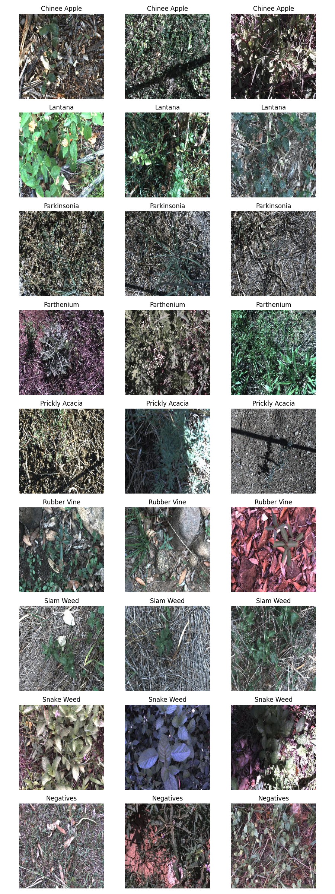
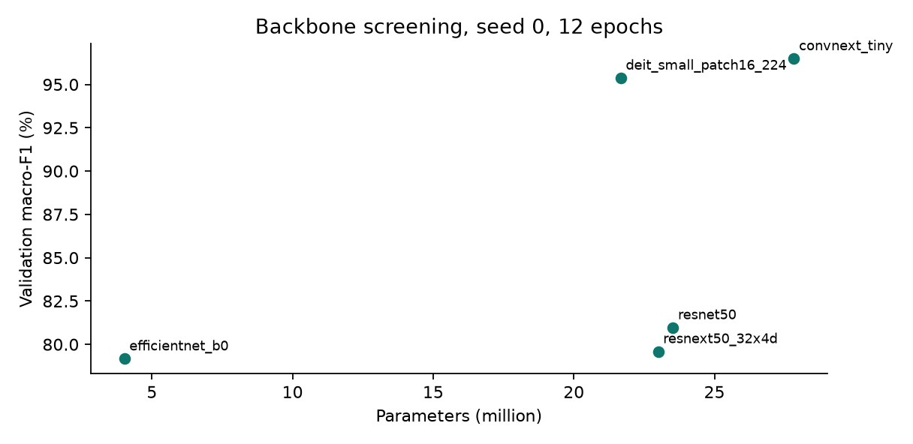
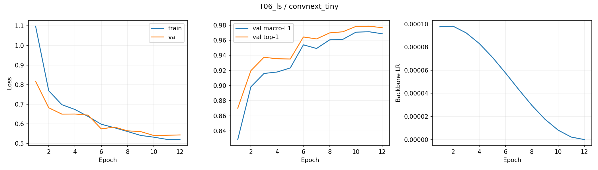
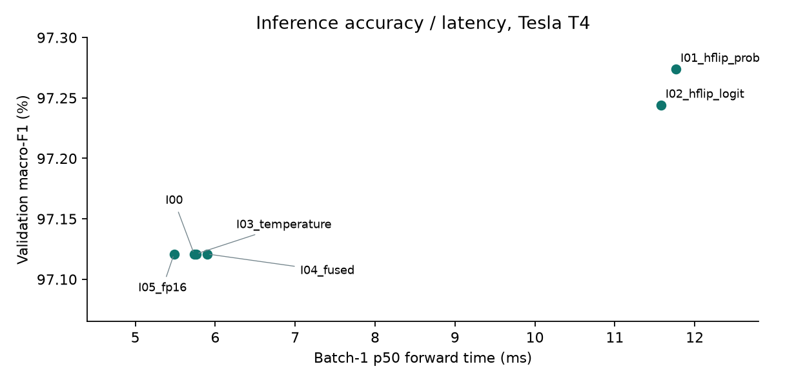
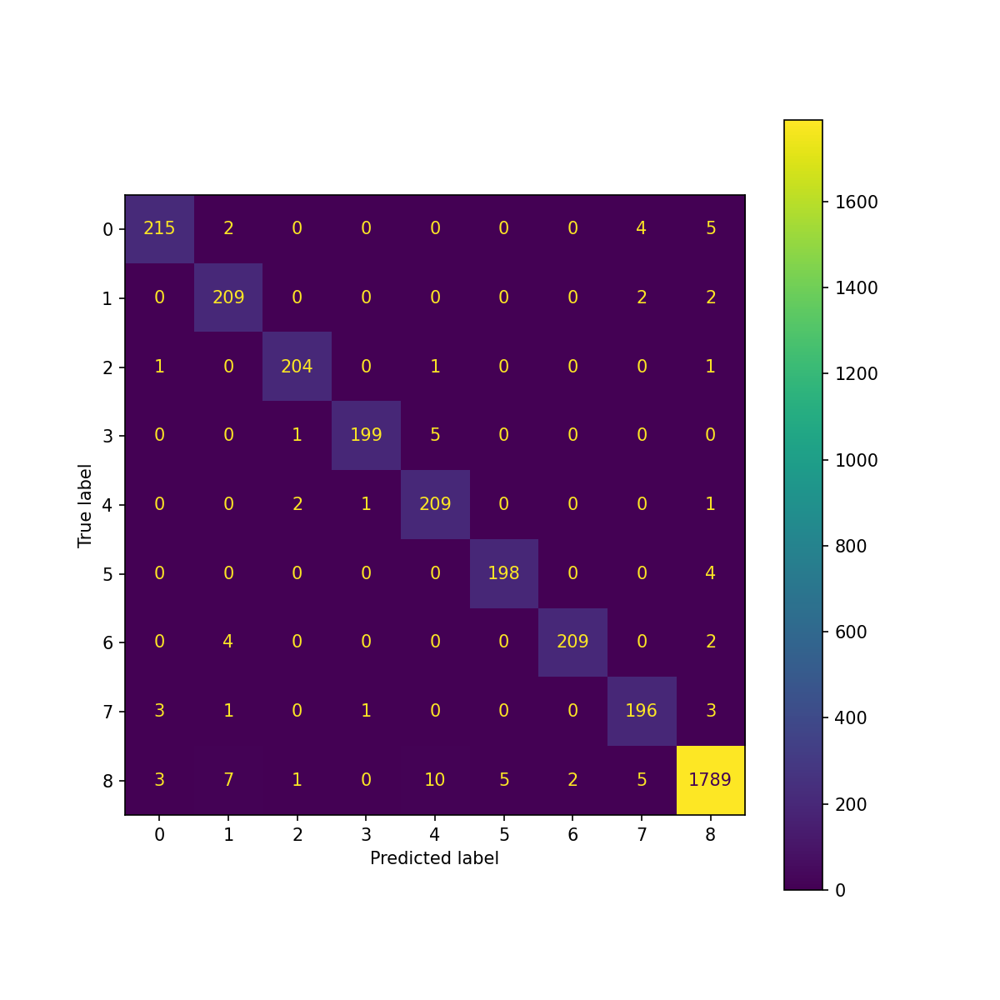
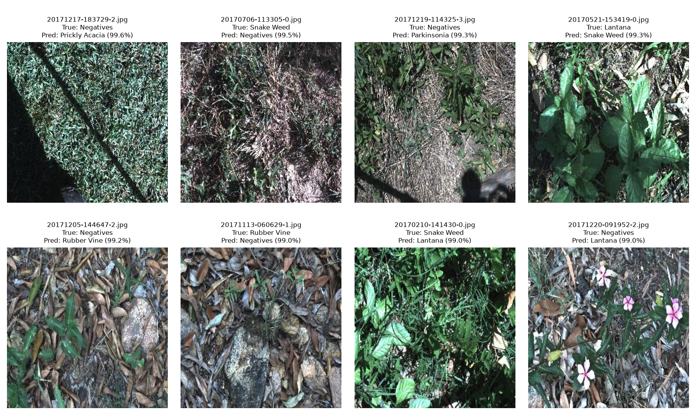

# DeepWeeds: so sánh backbone, công thức huấn luyện và suy luận

**Lab:** K4 Track4 Day2, Deep Learning Advance  
**Tài khoản Kaggle:** ntthduong  
**MSSV:** 2A202602905  
**Họ tên:** Nguyễn Thị Thùy Dương  
**Nguồn kết quả:** [notebook version 5, ID 355122553](https://www.kaggle.com/code/ntthduong/k4-track4-day2-deepweeds-lab?scriptVersionId=355122553).

## 1. Tóm tắt

Thực nghiệm phân loại 9 lớp DeepWeeds trên fold 0 chính thức. Đã so sánh 5 backbone, 10 biến thể huấn luyện ngoài mốc T00, 6 phương pháp suy luận và 2 cấu hình chung kết với seed 0/1/2. ConvNeXt-Tiny với label smoothing 0,1, TTA lật ngang gộp xác suất và temperature scaling khớp trên validation đạt macro-F1 test **97.151 ± 0.119%**, top-1 **97.776 ± 0.075%**, ECE **0.703 ± 0.110%**. Macro-F1 tăng **0.3509 điểm phần trăm** so với baseline. Các yếu tố tốt riêng lẻ không cộng dồn thành công trong T10. Số liệu và std được tính bằng `eval.py` nguyên bản từ các CSV dự đoán đã lưu.

## 2. Dữ liệu và thiết lập

DeepWeeds gồm 17.509 ảnh, 8 loài cỏ và lớp Negatives. Fold 0 có 10.501 ảnh train, 3.501 val, 3.507 test. Kiểm tra tên file cho thấy ba giao tập rỗng, hợp đủ 17.509 ảnh và ảnh tương ứng đều tồn tại. Lớp Negatives chiếm 1.822/3.507 ảnh test (51.95%), nên accuracy có thể che khuất sai số ở lớp ít ảnh. Chỉ số chọn mô hình là macro-F1 trung bình đều của 9 lớp. ECE dùng 15 bin đều, theo công cụ đánh giá chính thức.

Đối chiếu nhãn gốc với Table 1 được chép trong README đề: Chinee Apple 1.125; Lantana 1.064; Parkinsonia 1.031; Parthenium 1.022; Prickly Acacia 1.062; Rubber Vine 1.009; Siam Weed 1.074; Snake Weed 1.016; Negative 9.106. Tổng theo từng lớp khớp hoàn toàn, không thiếu ảnh. Negative chiếm 52,01% toàn bộ dữ liệu.

Train dùng RandomResizedCrop(224) và RandomHorizontalFlip; val/test Resize(256), CenterCrop(224), chuẩn hoá theo trọng số tiền huấn luyện. Công thức nền: AdamW, LR backbone 1e-4 và head 1e-3, weight decay 0,05, bỏ decay cho norm/bias, warmup 1 epoch rồi cosine, batch 64, 12 epoch, AMP. Chọn checkpoint bằng macro-F1 val tốt nhất. Seed thay khởi tạo head, thứ tự batch và augmentation, không đổi split.

Phần cứng đo suy luận là Tesla T4; code train dùng một GPU dù phiên Kaggle có thể cung cấp T4 ×2. Phiên bản lưu trong config: Python 3.13.15, PyTorch 2.11.0+cu128, timm 1.0.29. Trọng số ConvNeXt: `convnext_tiny.in12k_ft_in1k`. Config của từng run, cấu hình tiền xử lý và provenance nằm trong `runs/<exp_id>/seed<k>/config.json`.

Pipeline đã có kiểm tra focal gamma=0 tương đương CE, diện tích CutMix/lambda, optimizer groups, frozen BN, fusion và temperature. Log thật `evidence/__output__.json` ghi uniform loss 2,197224617 ≈ ln(9); head ngẫu nhiên có loss đầu 3,512908 (không sát ln(9)). Overfit một batch giảm loss còn 0,000001237 ở step 80 và đạt accuracy 1,0 sau 100 step. Notebook cũng hiển thị ảnh augmentation; hình này chưa được xuất riêng trong gói, có thể xem ở notebook online. Không diễn giải uniform loss thành loss đầu của head ngẫu nhiên. Version 5 hoàn tất trong 13.218,1 giây, khoảng **3 giờ 40 phút**, có tái sử dụng 5 backbone từ version 4. Vì vậy thời gian hơn một giờ của lần trước chỉ phản ánh vòng backbone. T00 tái sử dụng B03 seed 0; F01 seed 0 tái sử dụng T06_ls và baseline seed 0 tái sử dụng T00. Có 22 nhãn run B/T/F, tương ứng 19 lần train riêng biệt, trong đó 5 run được nhập từ vòng trước. Việc tái sử dụng không được tính là thêm seed độc lập.

## 3. So sánh backbone

| ID | Backbone | Params M | GMAC | F1 val % | Top-1 val % | s/epoch |
|---|---|---|---|---|---|---|
| B01 | resnet50 | 23.526 | 4.132 | 80.969 | 86.290 | 57.1 |
| B02 | resnext50_32x4d | 22.998 | 4.286 | 79.588 | 83.690 | 77.5 |
| B03 | convnext_tiny | 27.827 | 4.455 | 96.491 | 97.401 | 69.9 |
| B04 | deit_small_patch16_224 | 21.669 | 4.241 | 95.373 | 96.744 | 48.8 |
| B05 | efficientnet_b0 | 4.019 | 0.385 | 79.168 | 84.347 | 36.0 |

ConvNeXt-Tiny đứng đầu (96,491% macro-F1), hơn DeiT-S khoảng 1,118 điểm phần trăm và ResNet-50 khoảng 15,522 điểm. EfficientNet-B0 có chi phí tính toán và thời gian train thấp nhất nhưng F1 thấp hơn rõ rệt trong công thức 12 epoch này. Kết quả chưa chứng minh mọi trọng số của ConvNeXt luôn tốt hơn mọi ResNet: mỗi model dùng tag tiền huấn luyện riêng; công thức pretrained có thể ảnh hưởng đáng kể. Thống kê GMAC từ thop cũng có thể thiếu phép attention. Params/GMAC không thay thế được latency thực tế.

ConvNeXt-Tiny được chọn hoàn toàn bằng val để đi tiếp. Các ảnh `curves/B01_seed0.png` đến `B05_seed0.png` lưu loss train/val, F1 val và LR của từng backbone.

## 4. Ablation huấn luyện

| ID | Trục | Thay đổi | F1 val % | Delta / T00 (điểm %) |
|---|---|---|---|---|
| T00 | Mốc | Finetune; crop + flip; CE; không EMA | 96.491 | +0.000 |
| T01_scratch | A | Khởi tạo từ đầu | 29.529 | -66.962 |
| T02_frozen | A | Đóng băng backbone, chỉ train head | 85.058 | -11.433 |
| T03_color | B | Thêm ColorJitter (0.2, 0.2, 0.2, 0.05) | 96.833 | +0.342 |
| T04_cutmix | B | CutMix alpha=1 | 96.707 | +0.215 |
| T05_mixup | B | Mixup alpha=1 | 96.949 | +0.458 |
| T06_ls | C | Label smoothing epsilon=0.1 | 97.121 | +0.630 |
| T07_focal | C | Focal gamma=2 | 96.901 | +0.410 |
| T08_weighted | C | CE trọng số inverse-frequency | 96.318 | -0.173 |
| T09_ema | F | EMA decay=0.999 | 96.707 | +0.216 |
| T10_combined | B+C+F | ColorJitter + Mixup + smoothing + EMA | 96.548 | +0.056 |

Label smoothing đóng góp lớn nhất trong các biến thể đơn (+0,630 điểm phần trăm); Mixup (+0,458), focal (+0,410), ColorJitter (+0,342), EMA (+0,216) và CutMix (+0,215) đều tăng ở seed 0. CE có trọng số lớp giảm 0,173 điểm. F1 các lớp Chinee Apple, Snake Weed và Negatives của từng ablation được ghi trong Excel để nhìn đánh đổi ở lớp ít ảnh.

Focal tăng F1 val Chinee Apple từ 0,9360 lên 0,9536 và Snake Weed từ 0,9287 lên 0,9392; smoothing thắng về macro-F1 nhưng chỉ tăng hai lớp này lên 0,9388 và 0,9310. Loss trọng số tăng Chinee Apple lên 0,9462, song Snake Weed giảm xuống 0,9151 và Negatives xuống 0,9800. Cân bằng loss không đồng nghĩa mọi lớp ít ảnh đều được cải thiện. Đây vẫn là so sánh seed 0, chưa xác nhận độ bền qua seed riêng cho từng loss.

Scratch chỉ đạt 29,529% macro-F1 và frozen đạt 85,058%. Đây là bằng chứng rằng fine-tuning có lợi dưới ngân sách 12 epoch, không phải bằng chứng scratch không thể học nếu train lâu hơn. Các tăng nhỏ chỉ được sàng bằng một seed, chưa có std riêng cho từng ablation; không thể khẳng định chúng vượt nhiễu. Std của vòng chung kết không đại diện trực tiếp cho mọi recipe.

T10 kết hợp ColorJitter, Mixup, smoothing và EMA đạt 96,548%, thấp hơn T06_ls 0,573 điểm. Giả thuyết là regularization/augmentation chồng nhau hoặc lịch 12 epoch chưa phù hợp; thí nghiệm hiện tại chưa tách được nguyên nhân. Chọn T06_ls thay vì mặc định ghép mọi thành phần tốt. Các trục đã khảo sát: A (khởi tạo), B (augmentation), C (loss), F (EMA); chưa khảo sát D/E/G. Đường cong của từng run T00–T10 được nộp đầy đủ.

## 5. Phương pháp suy luận và hiệu chuẩn

Các phương pháp dưới dùng cùng checkpoint T06_ls seed 0. Các giá trị ECE trong bảng tính theo phần trăm; Excel giữ score 0–1.

| ID | K | F1 val % | ECE val % | p50 ms | p95 ms | p99 ms | Ảnh/s | Chi phí / I00 |
|---|---|---|---|---|---|---|---|---|
| I00 | 1 | 97.121 | 8.456 | 5.74 | 8.63 | 8.67 | 174.4 | 1.00 |
| I01_hflip_prob | 2 | 97.274 | 8.517 | 11.77 | 14.52 | 18.04 | 85.0 | 2.05 |
| I02_hflip_logit | 2 | 97.244 | 8.425 | 11.58 | 12.23 | 12.59 | 86.4 | 2.02 |
| I03_temperature | 1 | 97.121 | 0.553 | 5.76 | 6.31 | 6.45 | 173.6 | 1.00 |
| I04_fused | 1 | 97.121 | 8.456 | 5.90 | 6.42 | 6.62 | 169.6 | 1.03 |
| I05_fp16 | 1 | 97.121 | 8.453 | 5.48 | 5.93 | 6.70 | 182.3 | 0.96 |

TTA gộp xác suất tăng F1 val từ 97,121 lên 97,274%, nhưng p50 tăng từ 5,735 lên 11,767 ms, khoảng 2,05 lần. Gộp logits đạt 97,244%. Temperature của I03 bằng 0,632781; ECE val giảm từ 8,456 xuống 0,553%, còn nhãn argmax và F1 không đổi. Đây là hiệu chuẩn độ tin cậy, không phải tăng accuracy.

ConvNeXt dùng LayerNorm nên phép fusion Conv-BN của I04 là no-op, `fusion_max_abs=0`. Chênh lệch thời gian giữa I00/I04 không được diễn giải thành lợi ích fusion. FP16 giữ F1 ở phép đo này và có p50 5,485 ms; chưa thử kết hợp FP16 với TTA trong vòng chọn cuối.

Phép đo dùng eval/inference_mode, đồng bộ CUDA, warmup 10, 100 lượt. Ảnh/s = batch × 1000/p50, là ước lượng throughput forward. Phạm vi chưa tính đọc ảnh, resize/normalize, chuyển dữ liệu và gộp xác suất/temperature; p95 14,519 ms của TTA không phải end-to-end robot latency. Các phép đo bổ sung từ checkpoint, nếu có, được tách nguồn trong sheet Latency.

Sau lần chạy chính, đo bổ sung 5 backbone ở batch 1, 6 phương pháp ở batch 32 và 3 recipe còn thiếu latency trong top 10, chỉ dùng checkpoint và ảnh tensor ngẫu nhiên. Ở batch 32, I00 FP32 đạt khoảng 283,1 ảnh/s, TTA prob khoảng 137,4 ảnh/s, FP16 khoảng 825,3 ảnh/s. Thời gian p50 batch 32 của I00 khoảng 113,1 ms là thời gian cho cả batch, không phải latency một ảnh. Các số này cho thấy lợi ích throughput của FP16 ở batch lớn rõ hơn batch 1. Bảng Summary dùng đúng phép đo I00 cho T06_ls vì đó là cùng checkpoint; các recipe khác có phép đo riêng, không thay số thiếu bằng thời gian train.

## 6. Chung kết, per-class và lỗi

Cấu hình được lưu vào `selection.json` trước khi mở test: ConvNeXt-Tiny, fine-tune toàn mạng, recipe T06_ls, Hflip probability K=2, temperature fit riêng trên val cho mỗi seed. T của seed 0/1/2 lần lượt là 0,621719; 0,615128; 0,617458. Baseline là cùng ConvNeXt-Tiny nhưng CE và 1-view, không calibration. Các seed 0/1/2 đánh giá toàn bộ test một lần; file uncal xuất từ cùng logits, không phải một lượt test mới. Các chỉ số dưới là mean ± std mẫu qua seed.

| Cấu hình | F1 val % | F1 test % | Top-1 test % | ECE test % |
|---|---|---|---|---|
| F01 | 97.203 ± 0.140 | 97.151 ± 0.119 | 97.776 ± 0.075 | 0.703 ± 0.110 |
| T00_final | 96.737 ± 0.215 | 96.800 ± 0.057 | 97.500 ± 0.129 | 1.274 ± 0.161 |

Macro-F1 tăng 0.3509 điểm phần trăm, lớn hơn std F01 0.1189 điểm. Chênh lệch theo cặp seed là 0.3083, 0.4245, 0.3199 điểm, đều dương; chỉ 3 seed chưa đủ cho khẳng định ý nghĩa thống kê hoặc khoảng tin cậy vững chắc. Baseline đã là backbone thắng nên mức tăng cuối nhỏ hơn chênh lệch lớn giữa các backbone.

ECE test trước calibration của cùng F01: 8.668 ± 0.385%; sau calibration: 0.703 ± 0.110%. Hiệu chuẩn được fit trên val, không fit trên test. Khoảng cách mean F1 val/test là 0.0519 điểm phần trăm.

| Lớp | n test | Precision % | Recall % | F1 % | F1 baseline % |
|---|---|---|---|---|---|
| Chinee Apple | 226 | 96.160 ± 0.830 | 95.723 ± 1.422 | 95.933 ± 0.375 | 95.267 ± 0.769 |
| Lantana | 213 | 94.312 ± 1.346 | 98.279 ± 0.717 | 96.248 ± 0.449 | 96.560 ± 0.872 |
| Parkinsonia | 207 | 97.912 ± 0.728 | 98.068 ± 0.483 | 97.989 ± 0.554 | 97.515 ± 0.826 |
| Parthenium | 205 | 99.015 ± 0.483 | 97.724 ± 0.745 | 98.363 ± 0.289 | 97.612 ± 0.780 |
| Prickly Acacia | 213 | 93.731 ± 1.119 | 98.122 ± 0.000 | 95.874 ± 0.584 | 95.114 ± 0.162 |
| Rubber Vine | 202 | 98.025 ± 0.485 | 98.185 ± 0.286 | 98.104 ± 0.283 | 98.012 ± 0.264 |
| Siam Weed | 215 | 97.130 ± 1.984 | 98.295 ± 0.968 | 97.694 ± 0.576 | 97.925 ± 0.460 |
| Snake Weed | 204 | 95.351 ± 2.358 | 95.915 ± 1.234 | 95.610 ± 0.570 | 94.845 ± 0.404 |
| Negatives | 1822 | 99.095 ± 0.257 | 98.006 ± 0.365 | 98.547 ± 0.062 | 98.355 ± 0.218 |

Riêng Chinee Apple → Snake Weed có 4/2/8 ảnh ở seed 0/1/2; chiều ngược lại có 3/3/2 ảnh. Cặp này còn nhầm trực tiếp dù recall trung bình đều trên 95%. Các ảnh lỗi minh hoạ bên dưới thuộc những cặp khác; chưa có ảnh riêng của cặp Chinee Apple ↔ Snake Weed trong gói. Giả thuyết tương đồng hình thái cần kiểm chứng bằng ảnh của chính cặp này, không suy ra từ ví dụ khác. Chinee Apple và Snake Weed còn khó hơn nhiều lớp khác. Negatives nhiều nhất nên ngay cả recall cao vẫn có thể tạo nhiều lỗi tuyệt đối. Với seed 0, những cặp nhầm lớn nhất là Negatives → Prickly Acacia: 10, Negatives → Lantana: 7, Parthenium → Prickly Acacia: 5, Negatives → Snake Weed: 5. Ma trận nhầm lẫn của cả 3 seed có trong curves; hình dưới dùng seed 0, hàng là nhãn thật và cột là dự đoán.

Để tránh chọn ví dụ theo cảm tính, lấy tám cặp nhầm khác nhau từ seed 0, ưu tiên lỗi có xác suất dự đoán cao. Đây là phân tích sau đánh giá, không dùng để chỉnh recipe hay chạy lại test.

| Filename | Nhãn thật | Dự đoán | Độ tin cậy % |
|---|---|---|---|
| 20171217-183729-2.jpg | Negatives | Prickly Acacia | 99.6 |
| 20170706-113305-0.jpg | Snake Weed | Negatives | 99.5 |
| 20171219-114325-3.jpg | Negatives | Parkinsonia | 99.3 |
| 20170521-153419-0.jpg | Lantana | Snake Weed | 99.3 |
| 20171205-144647-2.jpg | Negatives | Rubber Vine | 99.2 |
| 20171113-060629-1.jpg | Rubber Vine | Negatives | 99.0 |
| 20170210-141430-0.jpg | Snake Weed | Lantana | 99.0 |
| 20171220-091952-2.jpg | Negatives | Lantana | 99.0 |

Quan sát ảnh 20170706-113305-0.jpg (Snake Weed → Negatives) và 20171113-060629-1.jpg (Rubber Vine → Negatives), nền đất/lá khô chiếm nhiều diện tích và phần lá xanh không nổi bật. Một giả thuyết là crop và biểu diễn toàn ảnh chưa giữ đủ đặc trưng cây mục tiêu. Ảnh 20171217-183729-2.jpg (Negatives → Prickly Acacia) có tán lá nhỏ rất dày cùng vùng tối lớn; các kết cấu gần nhau có thể gây false positive. Ảnh 20171220-091952-2.jpg có hoa hồng và nhiều lá, nhưng thuộc Negatives và được dự đoán Lantana. Lớp nền bao gồm thực vật nên không thể chỉ dựa vào việc có lá/hoa để quyết định loài.

Những lỗi này vẫn có độ tin cậy khoảng 99% sau hiệu chuẩn. ECE tốt trên toàn tập không đảm bảo từng ảnh được ước lượng tin cậy đúng. Các giả thuyết về nền, che khuất và độ tương đồng hình thái cần kiểm chứng bằng nhiều ảnh hoặc annotation vùng cây; không được xem là kết luận về sai nhãn của dataset. Không điều chỉnh cấu hình từ các ví dụ test này.

## 7. Kết luận và khuyến nghị triển khai

Trong công thức đã khảo sát, backbone là yếu tố tạo chênh lệch lớn nhất; smoothing tạo cải thiện recipe rõ nhất ở vòng một seed; Hflip TTA giúp thêm khoảng 0,153 điểm F1 val với chi phí xấp xỉ gấp đôi. Cấu hình chính thức là F01; lựa chọn accuracy cao nhất được giữ nguyên sau test.

Với robot có ngân sách 30–100 ms/khung, cân nhắc một-view ConvNeXt-Tiny + temperature (I03), dành thời gian còn lại cho camera và tiền xử lý. Nếu latency end-to-end trên thiết bị đích còn dư, cân nhắc F01 K=2. I05 FP16 là ứng viên forward nhanh hơn nhưng chưa được xác nhận end-to-end trên robot hay trong kết hợp TTA. Không dùng số T4 để cam kết đáp ứng thiết bị nhúng. Việc chọn triển khai này dựa trên validation/latency; chưa có thêm kết quả test cho I03/I05 và không lấy test chung kết để tiếp tục dò cấu hình.

## 8. Hạn chế và việc tiếp theo

Chỉ dùng fold 0; split theo ảnh chưa phản ánh tổng quát sang địa điểm/mùa mới. Vòng backbone/ablation chỉ một seed, recipe 12 epoch có thể chưa hội tụ cho scratch. Không chạy ensemble, model soup, FixRes, sampler và optimizer/LR ablation vì ngoài phạm vi tối thiểu đã chọn. Các tag pretrained khác nhau hạn chế kết luận thuần kiến trúc. Độ trễ forward và augmentation/TTA chưa bao quát hệ thống robot. Nếu có thêm ngân sách, nên lặp lại ablation then chốt qua nhiều seed và đánh giá miền mới theo một kế hoạch mới, giữ bộ test hiện tại là kết quả đã chốt.

Bảng đối chiếu yêu cầu và những điểm còn giới hạn nằm trong [RUBRIC_CHECK.md](RUBRIC_CHECK.md); không dùng điểm tự chấm phần I để khẳng định tổng điểm toàn bài.

## 9. Phụ lục và tái lập

Excel có đủ 7 sheet: Backbones, Training, Inference, Final, PerClass, Latency, Summary. Các delta và mean/std chung kết dùng công thức Excel; dữ liệu gốc và kiểm tra độc lập nằm trong evidence. `runs/` chỉ chứa config/history/summary, không chứa trọng số. Notebook và code đúng lần chạy được nộp trong code. Predictions giữ `Filename,y_true,y_pred,p0,...,p8` của eval.save_predictions, đầy đủ 3 seed cho F01 và baseline.

Chạy lại phép chấm từ predictions theo README của gói nộp, không cần GPU. Không tự sửa `eval.py`. Gói nộp không chứa dataset hoặc checkpoint. Ảnh lỗi gồm tám mẫu ghép trong figure để phân tích, không kèm JPEG dataset nguồn. Bài nộp của Nguyễn Thị Thùy Dương, MSSV 2A202602905; thư mục đặt theo mẫu của đề.
